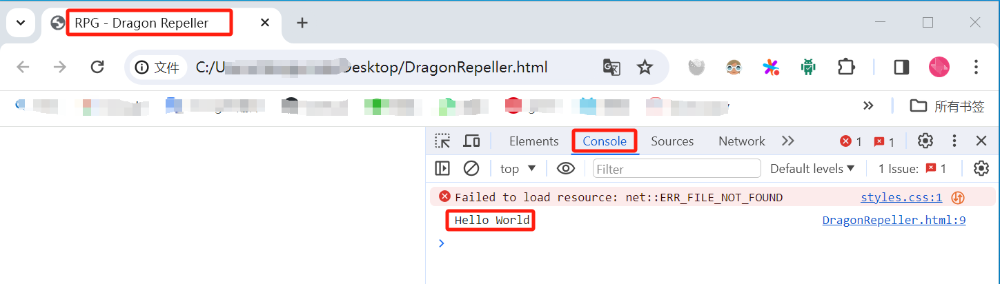

## 说明
1. 此目录是针对 [FreeCodeCamp: JavaScript Algorithms and Data Structures(Beta) Certification](https://www.freecodecamp.org/learn/javascript-algorithms-and-data-structures-v8/) 课程的说明。
2. 在本课程中，可以直接将内容输入到网页上；你也可以在本地新建相应的文件并键入相同代码，查看效果；

## 课程详解
### Lesson1
1. 新建一个 [DragonRepeller.html](./DragonRepeller.html) 并输入以下内容：
```html
<!DOCTYPE html>
<html lang="en">

<head>
	<meta charset="utf-8">
	<link rel="stylesheet" href="./styles.css">
	<title>RPG - Dragon Repeller</title>
</head>

<body>
	<div id="game">
	</div>
</body>

</html>
```
2. 在网页端输入以上代码并提交；

### Lesson2
1. 在以上代码的 `head`结尾加上 `script` 标签，用于插入 `javascript` 代码：
```html
<script>
</script>
```
2. 在网页端输入以上代码并提交；

### Lesson3
1. 在 `script` 标签中插入 `javascript` 日志代码：
```html
<script>
	console.log("Hello World");
</script>
```
2. 双击 `DragonRepeller.html` 文件，会在浏览器打开；按 `F12` 或者 `Ctrl+Shift+I` 打开前端调试页面，选择 `Console` 就可以看到网页输出的日志了。

3. 发现上面图片有一个 `Failed to load resource` 的错误，这是由于这个 `DragonRepeller.html` 引用了一个 `styles.css` 文件，再新建一个 `styles.css` 文件就可以了。
